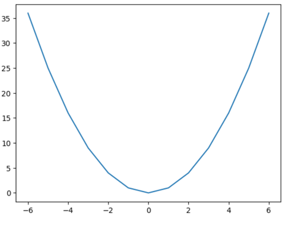

# Maths for Machine Learning - Basics

Maths ਇੱਕ important concept ਰੱਖਦਾ ਹੈ। Maths through computing ਕਮਾਲ ਦੀ ਚੀਜ਼ ਹੈ ਕਿਉਂਕਿ ਦੋਵੇਂ logic ਉੱਤੇ ਕੰਮ ਕਰਦੇ ਨੇ। Maths ਅਤੇ computing ਨੂੰ ਅਸੀਂ ਇੱਕ ਤੋਂ ਦੂਜੇ form ਵਿੱਚ ਆਰਾਮ ਨਾਲ ਲਿਖ ਸਕਦੇ ਆਂ ਅਤੇ answer ਕੱਢ ਸਕਦੇ ਆਂ।

ਤੇ ਹੋਰ ਵਧੀਆ ਗੱਲ ਇਹ ਹੈ ਕਿ ਜੇ ਤੁਸੀਂ **logic gates** ਦੇ concept ਨੂੰ ਪੜ੍ਹੋਗੇ ਤਾਂ ਪਤਾ ਲੱਗੇਗਾ ਕਿ transistor ਨੇ computing ਨੂੰ ਕਿੰਨਾ ਸੌਖਾ ਬਣਾਇਆ ਹੈ।

ਅਸੀਂ functions module 2 ਦੇ ਵਿੱਚ ਪੜ੍ਹ ਲਏ ਸੀ। ਹੁਣ ਅਸੀਂ machine learning ਦੇ maths ਨੂੰ ਪੜ੍ਹਾਂਗੇ। ਇਸਨੂੰ ਅਸੀਂ ਹੋਰ ਵੀ ਚੰਗੇ ਤੇ ਸੌਖੇ ਤਰੀਕੇ ਨਾਲ ਪੜ੍ਹਾਂਗੇ ਕਿਉਂਕਿ ਇਹ basics of maths in machine learning ਨੇ।

---

## 1. ਪਹਿਲਾ Concept - Mathematical Functions

Function maths ਵਿੱਚ ਕੀ ਕਰਦਾ ਹੈ? ਇੱਕ value ਨੂੰ ਦੂਜੀ ਵਿੱਚ convert ਕਰਦਾ ਹੈ।

ਇਸ ਦੀ ਲੋੜ ਕਿਉਂ ਹੈ? ਕਿਉਂਕਿ ਅਸੀਂ ਕਿਸੇ system ਨੂੰ maths ਵਿੱਚ variable ਤੇ equation ਨਾਲ ਲਿਖਦੇ ਆਂ, ਉਸ ਦੇ behaviour ਨੂੰ ਜਾਣਨ ਲਈ। System ਦੇ behaviour ਨੂੰ ਜਾਣ ਕੇ ਹੀ ਅਸੀਂ ਉਸਨੂੰ details ਵਿੱਚ study ਕਰ ਸਕਦੇ ਆਂ, ਅਸੀਂ ਉਸ ਦੇ changes ਨੂੰ observe ਕਰ ਸਕਦੇ ਆਂ।

ਪਹਿਲਾਂ ਇਹ code ਵੇਖੋ:

```python
def func(x: int) -> int:
    return 2 * x
```

ਬੜੀ ਹੀ interesting ਚੀਜ਼ ਹੈ ਇਹ। ਮੈਂ ਇਹ function define ਕੀਤਾ ਕਿ ਜੇ ਮੈਂ `x` ਦੀ value ਦੇਵਾਂਗਾ ਤਾਂ ਇਹ ਉਸਨੂੰ double ਕਰਕੇ ਦੇਵੇਗਾ। ਇੱਥੇ ਇਹ function `x` ਦੀ value ਨੂੰ 2 times `x` ਨਾਲ map ਕਰਦਾ ਹੈ।

ਇੰਝ ਸਮਝੋ ਕਿ ਮੈਂ ਇੱਕ ਬਾਂਦਰ ਨੂੰ ਕੇਲਾ ਦਿੱਤਾ, ਤੇ ਉਹ ਮੈਨੂੰ ਦੁੱਗਣੇ ਕੇਲੇ ਦਿੰਦਾ ਹੈ। ਇਹ ਹੁੰਦੀ ਹੈ **transformation**।

ਹੁਣ ਅਗਲਾ function ਵੇਖਦੇ ਆਂ:

```python
def func(x: int) -> int:
    return x ** 2

x = [-6, -5, -4, -3, -2, -1, 0, 1, 2, 3, 4, 5, 6]

y = list(map(lambda a: func(a), x))
print("x =", x, ", y =", y)
# x = [-6, -5, -4, -3, -2, -1, 0, 1, 2, 3, 4, 5, 6]
# y = [36, 25, 16, 9, 4, 1, 0, 1, 4, 9, 16, 25, 36]

# Matplotlib library ਇਸ plot ਨੂੰ graphical image ਦੇ form ਵਿੱਚ ਦਿਖਾਉਂਦੀ ਹੈ।
# ਜਿਵੇਂ ਤੁਸੀਂ modules ਸਿੱਖੇ ਸੀ, ਇੱਥੇ ਅਸੀਂ ਇੱਕ already ਬਣਿਆ ਹੋਇਆ module ਵਰਤ ਕੇ plot ਕਰ ਰਹੇ ਆਂ।
import matplotlib.pyplot as plt
plt.plot(x, y)
plt.show()
```



ਇਹ function ਹੁਣ number ਨੂੰ ਆਪਣੇ ਆਪ ਨਾਲ multiply ਕਰਕੇ result ਦਿੰਦਾ ਹੈ। ਜੇ ਅਸੀਂ graph ਬਣਾਈਏ ਤਾਂ ਇਸ ਦਾ graph **U shape** ਦਾ ਬਣਦਾ ਹੈ।

ਇਹ codes ਤੁਸੀਂ ਆਪ ਚਲਾ ਕੇ ਵੇਖੋ ਤੇ magic ਸਿੱਖੋ। ਹੁਣ ਵੇਖ ਸਕਦੇ ਹੋ ਕਿ ਇਹ ਕੀ ਕਰਦਾ ਹੈ — `x` ਨੂੰ function ਵਿੱਚ ਭੇਜਦਾ ਹੈ ਤੇ ਉਸ ਦੀ value ਨੂੰ 2D ਵਿੱਚ coordinate (X, Y) ਵਜੋਂ mark ਕਰਦਾ ਹੈ। ਇਹ grid representation ਹੁੰਦਾ ਹੈ।

ਇੰਝ ਅਸੀਂ maths ਦੇ functions ਵਰਤਦੇ ਆਂ। ਯਾਦ ਰੱਖੋ ਕਿ function ਇੱਕ input ਲੈਂਦਾ ਹੈ ਤੇ output ਦਿੰਦਾ ਹੈ — transform ਕਰਦਾ ਹੈ।

---

## 2. ਦੂਜਾ Concept - Numpy Arrays

**Change** mathematics ਦਾ ਇੱਕ ਬਹੁਤ ਸੋਹਣਾ concept ਹੈ। Change ਹੀ system ਨੂੰ interactive ਬਣਾਉਂਦਾ ਹੈ। ਜੇ change ਨਾ ਹੋਵੇ ਤਾਂ ਚੀਜ਼ਾਂ ਇੱਕ position ਤੋਂ ਦੂਜੀ position ਤੇ ਜਾ ਹੀ ਨਹੀਂ ਸਕਦੀਆਂ। Change ਸਾਡੇ ਲਈ important ਹੈ।

ਇਹੀ change ਸਾਡੇ neural network ਵਿੱਚ ਕੰਮ ਆਉਂਦਾ ਹੈ — ਅਸੀਂ ਕਹਿੰਦੇ ਆਂ ਕਿ network ਕਿਵੇਂ ਸਿੱਖਦਾ ਹੈ। ਇਹ ਛੋਟੇ-ਛੋਟੇ changes ਨਾਲ ਹੀ ਸਿੱਖਦਾ ਹੈ। ਇਹ changes ਅਸੀਂ ਕਿਵੇਂ ਸਮਝਾਉਂਦੇ ਆਂ ਕਿ ਕਿੱਧਰ ਜਾਣਾ ਹੈ — ਇਹ ਅਸੀਂ maths ਨਾਲ ਸਿੱਖਾਂਗੇ।

ਅਸੀਂ ਇੱਥੇ ਨਵੀਂ library ਵਰਤਣ ਜਾ ਰਹੇ ਆਂ ਜਿਸ ਦਾ ਨਾਮ ਹੈ **numpy**। ਬੜੀ ਹੀ ਵਧੀਆ library ਹੈ। ਇਸ ਵਿੱਚ maths ਦੇ functions defined ਨੇ ਅਤੇ ਅਸੀਂ ਉਹਨਾਂ ਨੂੰ ਵਰਤ ਸਕਦੇ ਆਂ।

```python
import numpy as np

x = np.arange(1, 10, 1)
print(x)
# output: array([1, 2, 3, 4, 5, 6, 7, 8, 9])
```

ਇਸੇ ਤਰ੍ਹਾਂ ਸਾਡੇ ਕੋਲ ਇੱਕ library ਹੈ **PyTorch**, ਜਿਸ ਦੇ ਵਿੱਚ tensors ਹੁੰਦੇ ਨੇ — ਅਤੇ ਖੂਬਸੂਰਤੀ ਇਹ ਹੈ ਕਿ ਇਹ GPU ਉੱਤੇ ਚੱਲਦੀ ਹੈ। ਹਾਂ, ਤੁਹਾਡਾ Graphical Processing Unit ਜੋ million of instructions ਚਲਾਉਂਦਾ ਹੈ। GPU ਬਾਰੇ ਅਸੀਂ ਅਲੱਗ module ਦੇ ਵਿੱਚ ਪੜ੍ਹਾਂਗੇ।

ਹੁਣ ਵੇਖਦੇ ਆਂ ਕਿ numpy ਕਿਵੇਂ ਵਰਤੀਦੀ ਹੈ ਅਤੇ change ਨੂੰ ਕਿਵੇਂ ਸਮਝੀਏ:

```python
import numpy as np

x = np.arange(0, 10, 1)
print(x)
# output: array([0, 1, 2, 3, 4, 5, 6, 7, 8, 9])

y = np.arange(20, 40, 2)
print(y)
# output: array([20, 22, 24, 26, 28, 30, 32, 34, 36, 38])

print(x + y)
# output: array([20, 23, 26, 29, 32, 35, 38, 41, 44, 47])
# what in the magic is this!

# ਹੁਣ ਇਹ try ਕਰੋ
x = [1, 2, 3]
y = [4, 5, 6]
print(x + y)
# output: [1, 2, 3, 4, 5, 6]  → python ਦਾ ਆਪਣਾ + operator
```

ਇਹ ਕੀ ਹੋਇਆ? ਉੱਪਰ ਵਾਲਾ add ਹੋ ਗਿਆ — ਇੱਥੇ `+` operator `x` ਤੇ `y` ਨੂੰ ਉੱਪਰ-ਥੱਲੇ ਰੱਖ ਕੇ add ਕਰ ਰਿਹਾ ਹੈ (element by element)। ਪਰ ਥੱਲੇ ਵਾਲਾ — ਜਿੱਥੇ python ਦੀ list ਹੈ — ਉੱਥੇ `+` ਨੇ ਦੋਵੇਂ lists ਨੂੰ ਜੋੜ ਕੇ ਇੱਕ ਵੱਡੀ list ਬਣਾ ਦਿੱਤੀ।

> ਇਹੀ ਫ਼ਰਕ ਹੈ python array ਅਤੇ numpy array ਵਿੱਚ — ਦੋਵੇਂ different ਨੇ।

`x` ਤੇ `y` ਇੱਕ unidimensional array ਨੇ, ਯਾਨੀ 1 dimensional array।

ਹੁਣ ਸਾਡੀ ਜ਼ਿੰਦਗੀ ਵਿੱਚ ਅਸੀਂ 3D system ਵਿੱਚ ਜੀਉਂਦੇ ਆਂ → length, breadth ਅਤੇ height। ਇਹ system ਅਸੀਂ represent ਕਰ ਸਕਦੇ ਆਂ। ਅਸੀਂ maths ਵਿੱਚ matrix ਪੜ੍ਹੀ ਸੀ — 3 × 3 matrix ਅਸੀਂ ਇਸ ਤਰ੍ਹਾਂ ਲਿਖ ਸਕਦੇ ਆਂ:

```python
import numpy as np

x = np.array([[1, 2, 3],
              [4, 5, 6],
              [7, 8, 9]])
print(x.shape)
# output: (3, 3)
# ਇਹ ਬੜਾ ਹੀ interesting ਹੈ — ਜਿੰਨਾ ਇਹ dimension ਸੌਖਾ ਦਿਸਦਾ ਹੈ ਓਨਾ ਹੈ ਨਹੀਂ।
# ਇਹ dimension ਉਦੋਂ confusing ਹੋ ਜਾਂਦਾ ਹੈ ਜਦੋਂ neural network ਵਿੱਚ ਅਸੀਂ ਇਸਨੂੰ multi-dimension ਬਣਾਉਂਦੇ ਆਂ।
```

Numpy ਜ਼ਰੂਰੀ ਹੈ ਕਿਉਂਕਿ ਸਾਨੂੰ data ਉੱਤੇ transformations ਚਾਹੀਦੇ ਹੁੰਦੇ ਨੇ, ਅਤੇ numpy already arrays ਉੱਤੇ ਇਹ functions provide ਕਰਦੀ ਹੈ।

> **ਜ਼ਰੂਰੀ ਗੱਲ:** Python arrays ਤੇ numpy arrays ਨੂੰ confuse ਨਾ ਕਰੋ, ਦੋਵੇਂ different ਨੇ। ਅਤੇ ਸਭ ਤੋਂ ਜ਼ਰੂਰੀ — **error ਪੜ੍ਹਨੇ ਸਿੱਖੋ**। ਜੇ error ਆਉਂਦਾ ਹੈ ਤਾਂ ਉਸਨੂੰ ਵੇਖੋ ਤੇ ਸਮਝਣ ਦੀ ਕੋਸ਼ਿਸ਼ ਕਰੋ। Error ਬਹੁਤ important ਹੁੰਦਾ ਹੈ ਸਿੱਖਣ ਲਈ — ਇਹ ਦੱਸਦਾ ਹੈ ਕਿ ਕਿੱਥੇ ਗ਼ਲਤੀ ਹੋ ਰਹੀ ਹੈ।

---

## 3. ਤੀਜਾ Concept - Change (Derivative)

ਪਹਿਲਾਂ ਇਹ example ਵੇਖੋ:

```python
def func(x: int) -> int:
    return x ** 2

x = [0.01, 0.02, 0.03]
y = list(map(lambda a: func(a), x))
# x = [0.01, 0.02, 0.03]
# y = [0.0001, 0.0004, 0.0009]
```

`x` ਜਦੋਂ 0.01 ਸੀ ਤਾਂ `y` ਆਇਆ 0.0001। ਜਦੋਂ `x` 0.01 ਤੋਂ 0.02 ਹੋਇਆ ਤਾਂ `y` 0.0001 ਤੋਂ 0.0004 ਹੋ ਗਿਆ।

ਹੁਣ ਇਹ change ਅਸੀਂ ਪੜ੍ਹਨਾ ਹੈ — ਇਸ change ਨੂੰ ਅਸੀਂ ਕਿਸ function ਨਾਲ ਲਿਖ ਸਕਦੇ ਆਂ? Answer is yes, ਤੇ ਇਸ ਦਾ ਨਾਮ ਹੈ **derivative**।

```python
# derivative function
from typing import Callable   # function ਨੂੰ ਅਸੀਂ Callable ਕਹਿੰਦੇ ਆਂ
from numpy import ndarray     # n-dimensional array
import numpy as np

def func(input_array: int) -> int:
    return input_array ** 2

def derivative_func(function: Callable[[ndarray], int],
                    array: ndarray,
                    delta=1) -> ndarray:
    return (function(array + delta) - function(array - delta)) / (2 * delta)

x = np.array([10, 20])

print(derivative_func(func, x))
# output: [20. 40.]
```

ਇਸਨੂੰ ਅਸੀਂ mathematically ਸਮਝਦੇ ਆਂ — ਇਹ 20 ਕਿਵੇਂ ਆਇਆ?

ਅਸੀਂ ਇਸਨੂੰ formally check ਕਰਦੇ ਆਂ। `func` ਦਾ derivative ਇੰਝ ਮਿਲਦਾ ਹੈ:

```
derivative = (func(11) − func(9)) / (2 × 1)
           = (121 − 81) / 2
           = 20

similarly:
derivative = (func(21) − func(19)) / (2 × 1)
           = (441 − 361) / 2
           = 40
```

ਹੁਣ ਇਹ ਵੇਖੋ:

```python
# derivative function (ਸਿੱਧਾ formula)
from numpy import ndarray   # n-dimensional array
import numpy as np

def func(input_array: int) -> int:
    return input_array ** 2

def derivative_func(array: ndarray):
    return array * 2

x = np.array([10, 20])

print(derivative_func(x))
# output: [20 40]
```

ਕਿਉਂਕਿ `x ** 2` ਦਾ derivative ਹੁੰਦਾ ਹੈ `2 * x`, ਸਾਨੂੰ ਸਾਡਾ answer ਮਿਲ ਗਿਆ।

ਇਸ ਦਾ ਮਤਲਬ ਹੈ ਕਿ ਜੇ ਅਸੀਂ `x` ਨੂੰ ਥੋੜ੍ਹਾ change ਕਰਦੇ ਆਂ ਤਾਂ function ਦੇ output ਉੱਤੇ ਉਹ ਕਿਵੇਂ change ਹੁੰਦਾ ਹੈ। ਇੱਥੇ change original value ਤੋਂ ਦੁੱਗਣਾ ਹੈ:

- Normal function: 10 → 100 (value square ਹੋ ਗਈ)
- Change (derivative): 10 → 20 (change double ਹੋ ਗਿਆ)

ਹੁਣ ਇਹ change ਜੋ ਹੈ, ਇੱਕ function ਦਾ ਹੈ। ਕਲਪਨਾ ਕਰੋ — ਲੱਖਾਂ functions, ਅਤੇ ਅਸੀਂ ਉਹਨਾਂ ਵਿੱਚ changes study ਕਰਦੇ ਆਂ, ਤੇ ਫਿਰ ਉਹ change layers ਦਰ layers ਵਿੱਚੋਂ ਲੰਘਦਾ ਹੈ — ਆਖ਼ਰਕਾਰ ਇੱਕ thinking chain ਅਤੇ observing chain ਬਣਾਉਂਦਾ ਹੈ।
