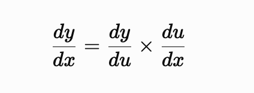

# More On Derivatives - Chain Rule & Backpropagation

ਪਿਛਲੇ lecture ਵਿੱਚ ਅਸੀਂ maths ਅਤੇ functions ਦੀ ਇੱਕ example ਵੇਖੀ ਸੀ ਅਤੇ ਪਤਾ ਲਾਇਆ ਸੀ ਕਿ derivatives ਕੀ ਹੁੰਦੇ ਨੇ।

Derivatives ਸਾਨੂੰ change ਸਮਝਣ ਵਿੱਚ ਮਦਦ ਕਰਦੇ ਨੇ। Neural network ਵਿੱਚ change ਸਮਝਣ ਦੀ ਲੋੜ ਕਿਉਂ ਹੈ? ਕਿਉਂਕਿ ਇਹ change ਹੀ ਮਦਦ ਕਰਦਾ ਹੈ ਇਹ ਸਮਝਣ ਵਿੱਚ ਕਿ data ਵੇਖਣ ਤੋਂ ਬਾਅਦ ਉਹ change ਕਿਵੇਂ reflect ਹੋਵੇਗਾ (numerical approximation)।

ਹੁਣ ਇੱਕ ਬਹੁਤ common term ਹੈ ਜਿਸਨੂੰ ਅਸੀਂ ਕਹਿੰਦੇ ਆਂ **backpropagation**। ਇਸ lecture ਵਿੱਚ ਅਸੀਂ ਪੜ੍ਹਾਂਗੇ ਕਿ ਇਹ backpropagation ਕੀ ਹੈ — code ਨਾਲ — ਤੇ ਸਮਝਾਂਗੇ ਕਿ ਸਾਡਾ system ਇੱਕ linear ਤੋਂ non-linear system ਵੱਲ ਕਿਵੇਂ ਜਾਂਦਾ ਹੈ।

Maths ਨੂੰ ਵੇਖਿਆ ਜਾਵੇ ਤਾਂ 2D, 3D, 4D arrays ਜੋ ਨੇ, ਉਹ ਇੱਕ system ਨੂੰ define ਕਰਦੇ ਨੇ ਅਤੇ ਇਹ system ਇੱਕ **surface** ਬਣਾਉਂਦਾ ਹੈ।

ਇਹ ਬੜਾ ਸੌਖਾ ਤੇ ਨਾਲ ਹੀ ਔਖਾ concept ਹੈ ਸਮਝਣ ਲਈ। Example — ਮੰਨ ਲਓ ਅਸੀਂ ਇੱਕ 3×3 array ਲਈ। ਫਿਰ ਇੱਕ array `[1, 2, 3]` — ਇਹ number ਸਾਨੂੰ coordinates ਦੱਸਦਾ ਹੈ। ਅਤੇ function ਸਾਨੂੰ ਦੱਸਦਾ ਹੈ ਕਿ ਇਸ coordinate/array ਦੀ value ਉਸ functional curve ਉੱਤੇ ਕੀ ਹੋਵੇਗੀ।

Functional curve ਸਾਡੀ ਕਈ ਤਰੀਕਿਆਂ ਨਾਲ ਮਦਦ ਕਰਦੀ ਹੈ। ਬਹੁਤ ਜ਼ਿਆਦਾ heavy terms ਨੇ, ਪਰ ਇਸ website ਨੂੰ ਵੇਖੋ — https://www.desmos.com/3d

ਬੱਸ type ਕਰੋ: `y = sin(x) + cos(x)`

ਹੁਣ `x` ਦੀਆਂ values ਲਈਆਂ ਤੇ `y` is equal to sin ਤੇ cos ਦੀ wave। ਹੁਣ ਮੈਂ ਇਸਨੂੰ 3D view ਵਿੱਚ ਦਿਖਾਉਣਾ। ਪਹਿਲਾ diagram 2D view ਹੈ ਜਦੋਂ ਅਸੀਂ ਦੋ planes ਵਿੱਚ ਵੇਖਦੇ ਆਂ। Sin ਤੇ cos ਇਹ curve ਬਣਾਉਂਦੀਆਂ ਨੇ।

ਅਤੇ ਇੱਕ interesting fact ਹੈ ਕਿ **sound waves** ਕਈ sin ਅਤੇ cos waves ਨਾਲ ਬਣਦੀਆਂ ਨੇ। ਹਰ ਆਵਾਜ਼, ਹਰ ਗੀਤ, ਹਰ ਧੁਨ ਨੂੰ sin ਅਤੇ cos waves ਦੇ function ਵਜੋਂ ਲਿਖਿਆ ਜਾ ਸਕਦਾ ਹੈ। ਅਤੇ **Fourier transform** ਹੀ ਇਸ ਤਰ੍ਹਾਂ ਦਾ function ਦੱਸਦਾ ਹੈ ਜੋ frequencies ਨੂੰ ਸਮਝਣ ਵਿੱਚ ਮਦਦ ਕਰਦਾ ਹੈ।


ਥੱਲੇ ਵਾਲਾ diagram ਸਾਡਾ 3D view ਹੈ, ਜੋ ਕਿ x, y ਅਤੇ z axis ਵਿੱਚ ਆਉਂਦਾ ਹੈ। ਇੰਝ ਸੋਚੋ ਕਿ ਇੱਕ ਰਿਬਨ ਨੂੰ ਫੜ ਕੇ ਉੱਪਰ ਨੂੰ ਖਿੱਚ ਕੇ height ਦੇ ਦਿੱਤੀ। ਹੁਣ ਇਹ ਸਾਰੇ functions N-dimensional form ਵਿੱਚ surface ਵਰਗਾ view ਬਣਾ ਰਹੇ ਨੇ।

ਤੇ Neural network ਕੀ ਨੇ? → data ਨੂੰ ਵੇਖ ਕੇ function ਦੱਸਣ ਵਾਲੇ networks। ਕਿਉਂਕਿ ਜੇ ਸਾਨੂੰ function ਪਤਾ ਲੱਗ ਗਿਆ ਤਾਂ ਅਸੀਂ ਸਾਰੇ functional points ਵੇਖ ਸਕਦੇ ਆਂ — ਅਤੇ ਇਹ functional points ਤੁਹਾਡਾ estimated data ਨੇ।

ਹੁਣ ਇਹ function ਨਹੀਂ, **approximation function** ਹੁੰਦੇ ਨੇ। ਇਹ exact function predict ਨਹੀਂ ਕਰਦੇ, ਕਿਉਂਕਿ — function ਨੂੰ approximate ਕਰਨ ਲਈ ਸਾਨੂੰ ਲਗਭਗ infinite data ਚਾਹੀਦਾ ਅਤੇ computing power ਚਾਹੀਦੀ।


ਇੱਥੋਂ ਤੱਕ ਕਿ ਇੱਕ cat ਅਤੇ dog ਦੀ image ਵੀ ਇੱਕ functional data point ਹੈ, ਅਤੇ ਅਸੀਂ ਕਹਿ ਸਕਦੇ ਆਂ ਕਿ ਇਹ ਇੱਕ higher dimensional data point ਤੋਂ ਆਈ ਹੈ ਜਿੱਥੇ ਸਾਰੀਆਂ cats ਤੇ dogs ਦੀਆਂ photos ਮੌਜੂਦ ਨੇ। ਇਹ ਖੂਬਸੂਰਤੀ ਹੈ machine learning ਅਤੇ deep learning ਦੀ।

ਹੁਣ ਅੱਗੇ ਚੱਲ ਕੇ ਅਸੀਂ ਪੜ੍ਹਾਂਗੇ ਕਿ transformers (ਜੋ ਕਿ ਅੱਜ ਦੇ large language models ਦਾ architecture ਹੈ) ਨੇ ਸਾਡੀਆਂ problems ਨੂੰ ਇੱਕ AI solution ਕਿਵੇਂ ਦਿੱਤਾ — next word ਦੀ approximation ਦੇ ਆਧਾਰ ਉੱਤੇ, ਜੋ ਇਸਨੇ ਬਹੁਤ ਸਾਰੇ data points ਵੇਖ ਕੇ ਸਿੱਖਿਆ। ਉਮੀਦ ਹੈ ਹੁਣ ਤੁਹਾਨੂੰ ਇਸ ਵਿੱਚ interest ਆ ਗਿਆ ਹੋਣਾ।

---

## Second Order Derivative - Function inside a Function

ਹੁਣ ਅਸੀਂ ਉਹ code ਕਰਦੇ ਆਂ ਜੋ ਅਸੀਂ ਪਿਛਲੇ lecture ਵਿੱਚ ਵੇਖਿਆ ਸੀ ਕਿ derivative ਕਿਵੇਂ find out ਕਰੀਏ। ਹੁਣ ਅਸੀਂ second order derivative ਵੇਖਾਂਗੇ।

ਇਸ ਵਿੱਚ ਅਸੀਂ ਇੱਕ function add ਕੀਤਾ — `random_function` — ਜੋ input ਨੂੰ square ਕਰਦਾ ਹੈ ਅਤੇ 20 ਨਾਲ number multiply ਕਰਦਾ ਹੈ। ਹੁਣ ਅਸੀਂ ਕੀ ਕਰਾਂਗੇ — square ਕਰਕੇ ਫਿਰ ਉਸ ਨੂੰ `random_function` ਵਿੱਚ ਪਾਵਾਂਗੇ। ਯਾਨੀ:

```
array  →  square  →  random_function  →  value
```

```python
# derivative function
from typing import Callable
from numpy import ndarray
import numpy as np

def square(input_array: int) -> int:
    return input_array ** 2

def random_function(input_array: int) -> int:
    return input_array ** 2 + 20 * input_array

def derivative_func(function: Callable[[ndarray], int],
                    array: ndarray,
                    delta=1) -> ndarray:
    return (function(array + delta) - function(array - delta)) / (2 * delta)

x = np.array([1, 2, 3, 4, 5])

res = random_function(square(x))
print(res)
# [  21   96  261  576 1125]
```

ਪਿਛਲੇ topic ਵਿੱਚ ਅਸੀਂ ਵੇਖਿਆ ਸੀ ਕਿ derivative number ਦਾ rate of change ਦੱਸਦਾ ਹੈ। ਹੁਣ `x` ਦੇ change ਹੋਣ ਨਾਲ final function ਕਿਵੇਂ change ਹੁੰਦਾ ਹੈ — ਇਹ ਹੁਣ **ਦੋ functions** ਉੱਤੇ depend ਕਰਦਾ ਹੈ। ਪਹਿਲਾਂ ਉਹ transform ਹੁੰਦਾ ਹੈ square ਕਰਕੇ, ਫਿਰ ਉਹ change ਹੁੰਦਾ ਹੈ `random_function` ਦੀ value ਕਰਕੇ।

ਇਹ ਸਮਝਣਾ ਕਿਉਂ important ਹੈ? ਕਿਉਂਕਿ ਇੱਕ transformer ਬੜੀ ਹੀ ਲੰਬੀ equation ਹੈ ਜੋ lots of input ਅਤੇ output functions ਵਿੱਚੋਂ ਹੋ ਕੇ ਨਿਕਲਦੀ ਹੈ। ਹੁਣ ਇੱਕ function ਦੇ input ਤੋਂ output ਨੂੰ ਕਹਿੰਦੇ ਨੇ **layer** — ਤੇ ਜਿੰਨੀਆਂ layers ਹੋਣਗੀਆਂ ਓਨਾ ਹੀ function complex data ਨੂੰ ਯਾਦ ਰੱਖ ਸਕਦਾ ਹੈ।

ਚਲੋ ਹੁਣ ਅਸੀਂ second derivative ਕੱਢਦੇ ਆਂ **chain rule** ਵਰਤ ਕੇ। Inputs ਅਸੀਂ ਬਦਲ ਦਿੱਤੇ ਨੇ ਤਾਂ ਜੋ ਸੌਖਿਆਂ ਸਮਝ ਆ ਜਾਵੇ।

```python
# derivative function
from typing import Callable   # function ਨੂੰ ਅਸੀਂ Callable ਕਹਿੰਦੇ ਆਂ
from numpy import ndarray     # n-dimensional array
import numpy as np

def square(x: int) -> int:
    return x ** 2

def random_function(u: int) -> int:
    return u ** 2 + 20 * u

def derivative_func(function: Callable[[ndarray], int],
                    array: ndarray,
                    delta=1) -> ndarray:
    return (function(array + delta) - function(array - delta)) / (2 * delta)

input_array = np.array([1, 2, 3, 4, 5])

FoG = random_function(square(input_array))
print(FoG)
# [  21   96  261  576 1125]

derivative_output = derivative_func(random_function, square(input_array)) * derivative_func(square, input_array)
print(derivative_output)
# [ 44. 112. 228. 416. 700.]

def derivative_using_formula(input_array):
    return 4 * input_array ** 3 + 40 * input_array

print(derivative_using_formula(input_array))
# [ 44 112 228 416 700]
```

ਕਿੰਨੀ ਸੋਹਣੀ ਚੀਜ਼ ਹੈ ਇਹ! ਹੁਣ ਵੇਖੋ ਦੋਵੇਂ derivatives ਦਾ answer same ਆਉਂਦਾ ਹੈ, ਪਰ ਦੋਵੇਂ ਅਲੱਗ-ਅਲੱਗ methods ਨਾਲ ਕੱਢੇ ਗਏ ਨੇ।

ਪਹਿਲਾ method ਅਸੀਂ ਇਹ ਵਰਤਿਆ ਹੈ — **chain rule**:

```
(f∘g)′(x) = f′(g(x)) × g′(x)
```

`(f∘g)` ਤੁਹਾਡਾ `FoG` ਹੈ ਜੋ ਕਿ combined function ਹੈ, ਅਤੇ ਇਸ ਦਾ derivative ਕੱਢਣ ਦਾ formula ਉੱਪਰ ਵਾਲਾ ਹੁੰਦਾ ਹੈ।



---

## ਚਲੋ ਪੂਰੀ ਗੱਲ ਖੋਲ੍ਹ ਕੇ ਸਮਝਾਉਂਦੇ ਆਂ

ਉੱਪਰ ਵਾਲੇ formula ਨੂੰ **chain rule** ਕਹਿੰਦੇ ਨੇ, ਜੋ ਇੰਝ ਵੀ ਲਿਖਿਆ ਜਾਂਦਾ ਹੈ:

```
(f∘g)′(x) = f′(g(x)) × g′(x)
```

### u, x, ਤੇ y ਦੇ ਨਾਲ ਸਮਝੀਏ

ਸਾਡੇ ਕੋਲ ਦੋ functions ਨੇ:

- `g = square` → inner function (ਪਹਿਲਾਂ ਚੱਲਦਾ)
- `f = random_function` → outer function (ਬਾਅਦ ਵਿੱਚ ਚੱਲਦਾ)

ਚੇਨ ਇੰਝ ਬਣਦੀ ਹੈ:

```
x  ──[ g = square ]──►  u  ──[ f = random_function ]──►  y
```

- `x` : input — ਜੋ ਅਸੀਂ ਪਾਉਂਦੇ ਆਂ (ਜਿਵੇਂ `input_array`)
- `u` : middle value — square ਦਾ output, ਜੋ f ਦਾ input ਬਣਦਾ
- `y` : final output — ਪੂਰੀ chain ਦਾ ਨਤੀਜਾ (`FoG`)

ਯਾਨੀ:

```
u = g(x) = x²           → square(x)
y = f(u) = u² + 20u     → random_function(u)
```

### ਹੁਣ derivative (chain rule)

ਅਸੀਂ ਚਾਹੁੰਦੇ ਆਂ: `dy/dx` (x ਬਦਲਣ ਨਾਲ y ਕਿੰਨਾ ਬਦਲਦਾ)

ਪਰ y ਸਿੱਧਾ x ਉੱਤੇ depend ਨਹੀਂ ਕਰਦਾ — ਵਿਚਕਾਰ u ਹੈ। ਤਾਂ ਅਸੀਂ chain ਤੋੜ ਕੇ ਦੋ ਟੁਕੜਿਆਂ ਵਿੱਚ ਲਿਖਦੇ ਆਂ:

```
dy/dx  =  dy/du  ×  du/dx
          (f′)       (g′)

dy/du = f′(u) = 2u + 20     → u ਦੇ ਹਿਸਾਬ ਨਾਲ f ਦਾ derivative
du/dx = g′(x) = 2x          → x ਦੇ ਹਿਸਾਬ ਨਾਲ g ਦਾ derivative
```

### Code ਨਾਲ match ਕਰੀਏ

`derivative_func(random_function, square(input_array))` → `f′(g(x)) = dy/du`
(ਇੱਥੇ array = `square(input_array)` = u, ਯਾਨੀ f ਨੂੰ u ਉੱਤੇ differentiate ਕੀਤਾ)

`derivative_func(square, input_array)` → `g′(x) = du/dx`
(ਇੱਥੇ array = `input_array` = x, ਯਾਨੀ g ਨੂੰ x ਉੱਤੇ differentiate ਕੀਤਾ)

ਦੋਵਾਂ ਨੂੰ × ਕਰ ਦਿੱਤਾ → `dy/du × du/dx = dy/dx` ✓ chain rule!

```python
derivative_output = derivative_func(random_function, square(input_array)) * derivative_func(square, input_array)
#                   └────── f′(g(x)) = dy/du ──────┘   └───── g′(x) = du/dx ─────┘
```

---

## ਦੂਜਾ method: ਸਿੱਧਾ formula

ਜੇ ਅਸੀਂ ਪਹਿਲਾਂ ਹੀ y ਨੂੰ x ਦੇ ਹਿਸਾਬ ਨਾਲ ਖੋਲ੍ਹ ਲਈਏ:

```
y = (x²)² + 20(x²)
  = x⁴ + 20x²
```

ਫੇਰ ਸਿੱਧਾ differentiate:

```
dy/dx = 4x³ + 40x      → derivative_using_formula
```

```python
def derivative_using_formula(input_array):
    return 4 * input_array ** 3 + 40 * input_array
```

ਦੋਵੇਂ methods ਦਾ answer same ਆਉਂਦਾ — `[44, 112, 228, 416, 700]` — ਕਿਉਂਕਿ chain rule ਅਸਲ ਵਿੱਚ ਇਹੀ ਕੰਮ ਕਰਦਾ ਹੈ ਜੋ ਅਸੀਂ `x⁴ + 20x²` ਨੂੰ ਹੱਥ ਨਾਲ differentiate ਕਰਕੇ ਕੀਤਾ। ਫ਼ਰਕ ਸਿਰਫ਼ ਇਹ ਹੈ ਕਿ ਪਹਿਲਾ method chain ਨੂੰ ਟੁਕੜਿਆਂ ਵਿੱਚ ਤੋੜ ਕੇ numerical ਤਰੀਕੇ ਨਾਲ ਕੱਢਦਾ, ਤੇ ਦੂਜਾ formula ਪਹਿਲਾਂ ਹੀ ਪੂਰਾ solve ਕਰਕੇ।

> **ਇੱਕ ਛੋਟੀ ਗੱਲ ਧਿਆਨ ਦੇਣ ਵਾਲੀ:** `delta=1` ਨਾਲ numerical derivative ਏਨਾ ਸਹੀ ਇਸ ਕਰਕੇ ਆਇਆ ਕਿਉਂਕਿ ਇਹ functions polynomial ਨੇ ਤੇ symmetric difference formula ਵਰਤੀ ਗਈ — ਪਰ ਆਮ functions ਲਈ delta ਛੋਟਾ (ਜਿਵੇਂ 0.001) ਰੱਖਣਾ ਪੈਂਦਾ।