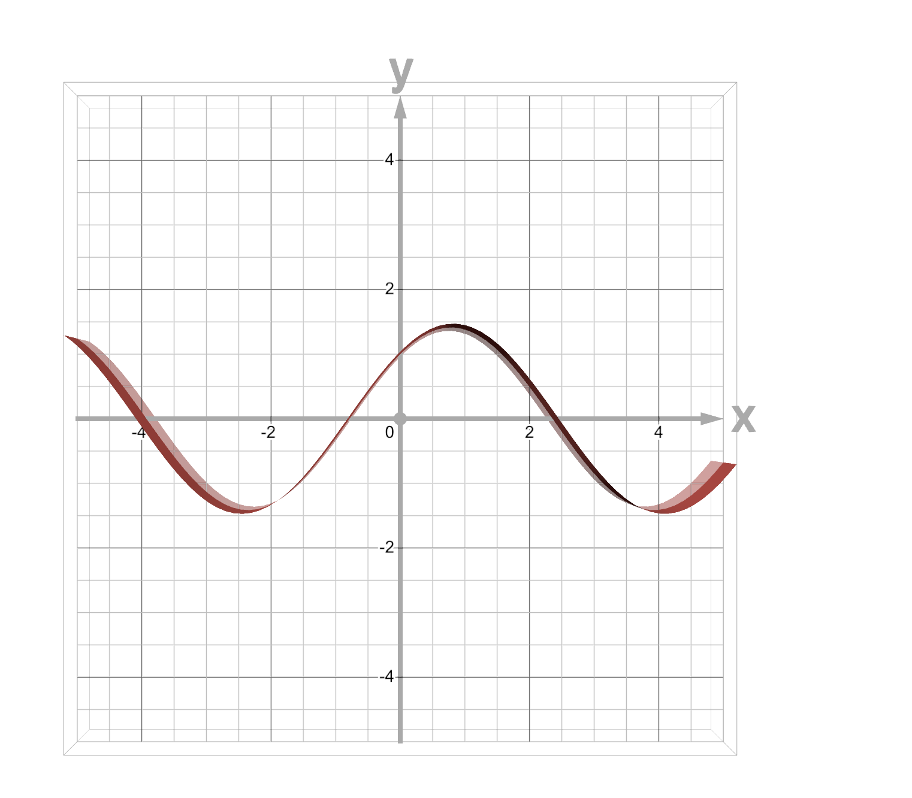
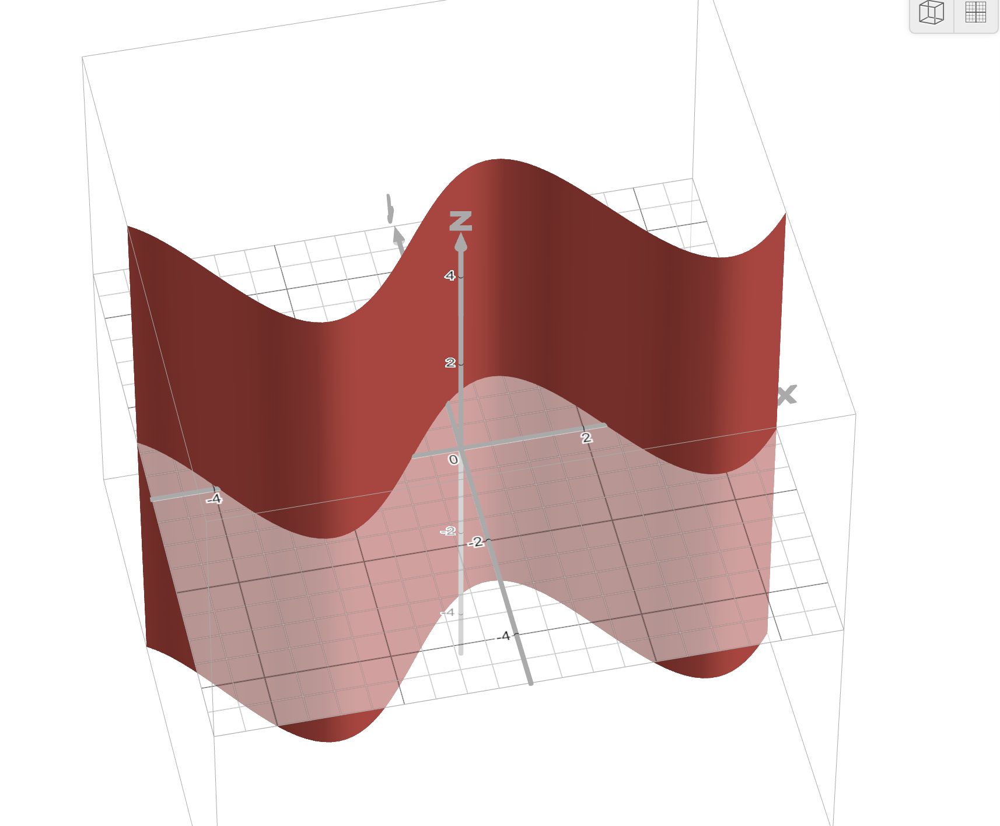

Last lecture ch asi ik example dekhi Maths and functions di and we found out what derivatives are.

Now derivates help us understand change. Why we need to understand change in nerual network? because eh change hi help karda a to understand numerical approximation of how the change will reflect after seeing the data. Hun ik bhot common term hai jisnu asi kehnde a backpropagation. es lecture ch asi padhange eh backpropagation ki hai with code te samjhange kive sada system ik linear to non linear system val janda hai. Maths nu dekheya jaye te 2d , 3d , 4d arrays jehre ne oh ik system nu define karde ne and eh system jehra hai ik surface bananda hai.

THis is very easy and difficult to understand at the same time. example asi kite 3x3 array, then ik array ik [1,2,3] eh number ki dasda hai sanu coordinates. and function ki dasda hai ki eh coordinate/array di value ki hoyegi on that functional curve. functional curve helps us in lot of ways. bhot zada heavy terms ne but look into this website - https://www.desmos.com/3d

Just type y = sin(x) + cos(x)

hun x di values lyian and y is equal to sin te cos di wave. hun main eda 3d view dikhana. first diagram is the 2d view when we see in two planes. sin te cos form ehda curve banandi hai. te ik interesing fact haiga a ki sound waves are formed by many sin and cos waves. every voice, every song, every melody can be written as function of sin and cos waves. te fourier transform hi edan da function dasda hai jehra frequencies nu samjhan ch help karda hai.



below diagram haiga sada 3d view, jo ki anda hai x y and z axis vich. eda socho ki ribbon nu far ke upar nu khich ke height de diti. now all these functions are creating surface like view in the N dimensional form. Te Neural network ki ne -> data nu dekh ke function dasan vale networks. kionki j sanu function pta lg gya asi dekh sakde pure functional points and these functional points are your estimated data. hun eh function nai approximation function hunde ne. they dont predict exact function because - sanu near inifinte data chaida function nu approximate karan lyi and computing power chaidi a



Even a cat and dog image is a functional data point and we can say it is from a higher dimensional data point where all cats and dogs photos exits. eh beauty hai machine learning and deep learning di.
Now agge chal ke asi padhange how transformers ( jo ki aj de large language models da architecture hai ) ne sadi problems nu ik AI solution dita based on the approximation of next word jo ki ene sikheya bhot sare data points nu dekh ke. I hope hun te interest a gya hona ede vich.

hun asi karde a code jo ki asi dekheya c last lecture vich ki derivative kiven find out karde a. hun asi dekhange second order of derivative. ede ch asi ik function add kita random_function jo ki input nu sqaure karda hai and 20 nal number multiply karda hai. hun asi ki karange square karke fer cube function ch input pavange i.e.
array -> square -> random_function -> value

```python
# derivative function
from typing import Callable   # function ਨੂੰ ਅਸੀਂ Callable ਕਹਿੰਦੇ ਆਂ
from numpy import ndarray     # n-dimensional array
import numpy as np

def square(input_array: int) -> int:
    return input_array ** 2

def random_function(input_array: int) -> int:
    return input_array ** 2 + 20 * input_array

def derivative_func(function: Callable[[ndarray], int],
                    array: ndarray,
                    delta=1) -> ndarray:
    return (function(array + delta) - function(array - delta)) / (2 * delta)

x = np.array([1, 2, 3, 4, 5])

res  = random_function(square(x))
print(res)
# [  21   96  261  576 1125]
```

last topic ch asi dekheya ki eh number da rate of change dasda hai derivative. hun
x de change hon nal final function kidan change hunda hai eh hun do functions utte depend karda hai. pehlan oh transform hunda hai square karke fer oh change hunda hai random_function di value karke. 
eh kyo samajhana important hai? kionki ik transformer bdi hi lambi equation hai jo ki lots of input and output functions vicho ho ke nikalda hai. hun ek function de input to output kehnde ne layer te jiniyan layers hon ona hi function complex data nu yaad rakh sakda hai. 
chalo hun apan second derivative kadd de a using chain rule and inputs asi change kite ne tanki easily samagh aje. 


```python


# derivative function
from typing import Callable   # function ਨੂੰ ਅਸੀਂ Callable ਕਹਿੰਦੇ ਆਂ
from numpy import ndarray     # n-dimensional array
import numpy as np

def square(x: int) -> int:
    return x ** 2

def random_function(u: int) -> int:
    return u ** 2 + 20 * u

def derivative_func(function: Callable[[ndarray], int],
                    array: ndarray,
                    delta=1) -> ndarray:
    return (function(array + delta) - function(array - delta)) / (2 * delta)

input_array = np.array([1, 2, 3, 4, 5])

FoG  = random_function(square(input_array))
print(FoG)
# [  21   96  261  576 1125]

derivative_output =  derivative_func(random_function, square(input_array)) * derivative_func(square, input_array)

print(derivative_output)
# [ 44. 112. 228. 416. 700.]

def derivative_using_chain_rule(input_array):
    return 4 * input_array ** 3 + 40 * input_array

print(derivative_using_chain_rule(input_array))
# [ 44 112 228 416 700]

```

kini sohni cheez a eh !! hun dekho dono derivatives da answer same anda right but dono alag alag methods de naal kadde gye ne 
pehla method asi use kita hai eh - 
(f∘g)′(x)=f′(g(x))×g′(x)

(f∘g) is your FoG jehra ki combined function haiga 